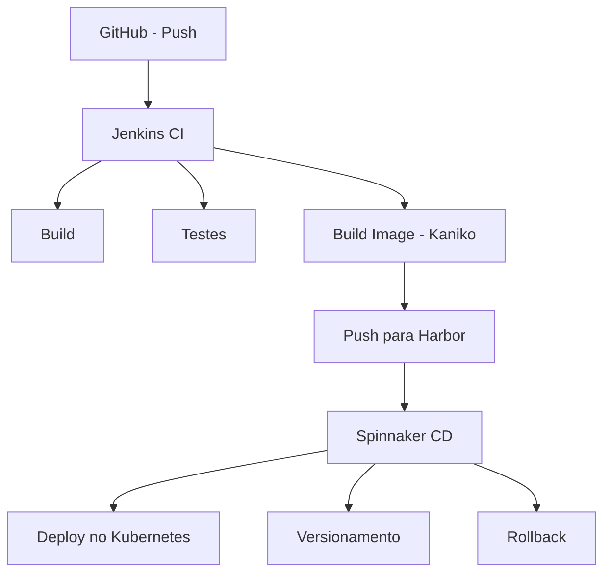

# CI/CD Lab

Laboratório local para simular um **pipeline CI/CD completo**, com ferramentas amplamente utilizadas em ambientes reais de produção.

---

## 🎯 Objetivo

Orquestrar o fluxo completo **CI → CD**, desde o push no GitHub até o deploy no Kubernetes, permitindo testes locais realistas de build, versionamento, deploy e rollback.

---

## 🧰 O que esse lab faz

* ✅ **Kind** como cluster Kubernetes local
* ✅ **Jenkins** rodando dentro do Kubernetes
* ✅ **Harbor** como registry privado de imagens Docker
* ✅ **Spinnaker** para Continuous Delivery
* ✅ Aplicação de exemplo com **Dockerfile**
* ✅ Pipeline de **CI no Jenkins** usando **Kaniko** (sem Docker-in-Docker)

---

## 🔄 Fluxo CI/CD

### Visão lógica do pipeline



### Fluxo textual simplificado

```text
GitHub
  ↓ (push)
Jenkins (CI)
  - build
  - testes
  - build da imagem (Kaniko)
  - push para o Harbor
  ↓
Spinnaker (CD)
  - deploy no Kubernetes
  - controle de versões
  - rollback
```

---

## 🧪 O que pode ser testado neste lab

* Estratégias de CI em Kubernetes
* Build de imagens sem acesso ao Docker daemon
* Integração Jenkins + Harbor
* Deploy contínuo com Spinnaker
* Versionamento e rollback de aplicações

---

## 📌 Observações

* Todo o ambiente roda **localmente**
* Ideal para estudo, POCs e validação de pipelines antes de levar para cloud
* O setup simula problemas e decisões comuns de ambientes corporativos

---

## 🚀 Próximos passos (opcional)

* Adicionar scan de vulnerabilidades no Harbor
* Integrar testes de qualidade (SonarQube)
* Simular múltiplos ambientes (dev / stage / prod)
