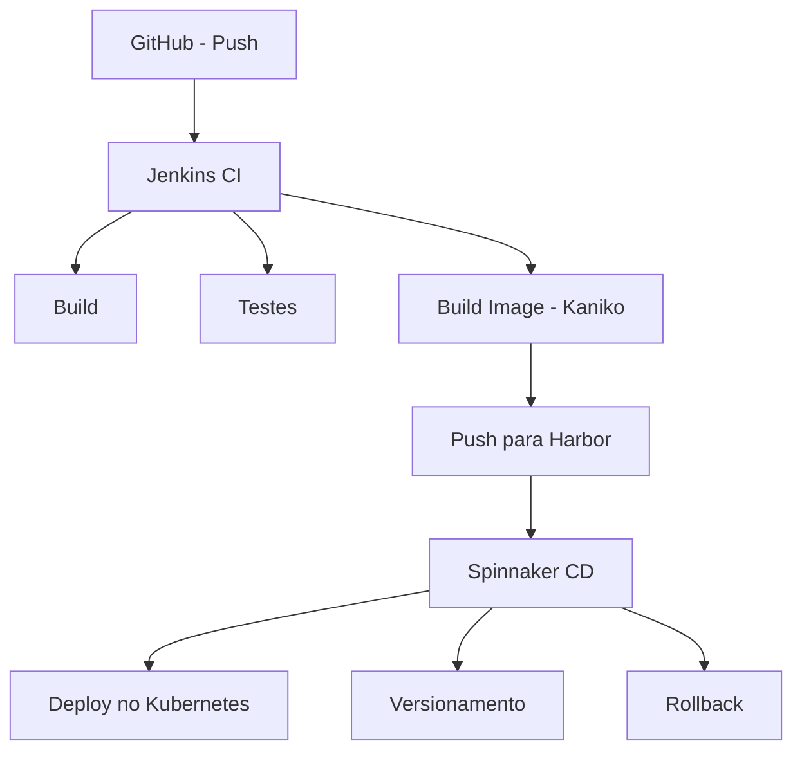

# CI/CD Lab

Laboratório **CI/CD local** para simular pipelines reais utilizados em ambientes corporativos, utilizando Kubernetes e ferramentas amplamente adotadas no mercado.

Este projeto foi criado com foco em **estudo, POCs e experimentação prática**, permitindo validar decisões de arquitetura e automação antes de levá-las para ambientes cloud.

---

## 🎯 Objetivo

Demonstrar e orquestrar um fluxo completo de **Continuous Integration e Continuous Delivery (CI → CD)**, cobrindo desde o push de código até o deploy versionado no Kubernetes, com suporte a rollback.

---

## 🧰 Stack utilizada

* **Kubernetes local:** Kind
* **CI:** Jenkins (executando dentro do cluster)
* **Build de imagens:** Kaniko (sem Docker-in-Docker)
* **Registry:** Harbor (privado)
* **CD:** Spinnaker
* **Aplicação com Spring:** Exemplo containerizado com Dockerfile

---

## 🔄 Fluxo CI/CD

### Visão lógica do pipeline



### Fluxo resumido

```text
GitHub
  ↓ (push)
Jenkins (CI)
  - build
  - testes
  - build da imagem (Kaniko)
  - push para o Harbor
  ↓
Spinnaker (CD)
  - deploy no Kubernetes
  - controle de versões
  - rollback
```

---

## 🧪 O que pode ser explorado neste laboratório

* Execução de CI dentro do Kubernetes
* Build seguro de imagens sem acesso ao Docker daemon
* Integração entre Jenkins e Harbor
* Estratégias de deploy contínuo com Spinnaker
* Versionamento e rollback de aplicações

---

## ⚙️ Requisitos

* Docker
* Kind
* kubectl
* Helm

> ⚠️ Recomendado rodar em máquinas com pelo menos **8GB de RAM**.

---

## 📌 Observações

* Todo o ambiente roda **localmente**
* Não depende de cloud provider
* Ideal para aprendizado, testes e validações técnicas

---

## 🚀 Próximos passos

* Adicionar scan de vulnerabilidades no Harbor
* Integrar análise de qualidade (SonarQube)
* Simular múltiplos ambientes (dev / stage / prod)

---

## 📄 Licença

Projeto para fins educacionais e experimentais.
