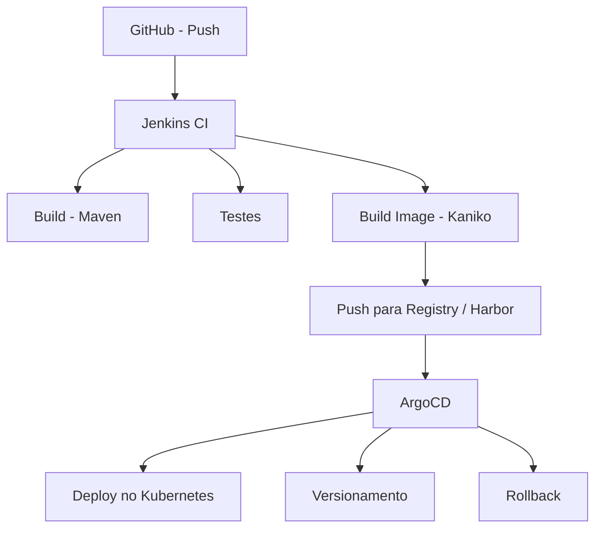

# CI/CD Lab

Laboratório **CI/CD local** para simular pipelines reais utilizados em ambientes corporativos, utilizando **Kubernetes** e ferramentas amplamente adotadas no mercado.

Este projeto foi criado com foco em **estudo**, **POCs** e **experimentação prática**, permitindo validar decisões de **arquitetura**, **automação** e **estratégias de entrega contínua** antes de levá-las para ambientes cloud.

---

## 🎯 Objetivo

Demonstrar e orquestrar um fluxo completo de **Continuous Integration e Continuous Delivery (CI → CD)**, cobrindo desde o **push de código** até o **deploy versionado no Kubernetes**, utilizando **GitOps** com suporte a **rollback**.

---

## 🧰 Stack utilizada

- **Kubernetes local**: Kind  
- **CI**: Jenkins (executando **dentro do cluster**)  
- **Build**: Maven  
- **Build de imagens**: Kaniko (**sem Docker-in-Docker**)  
- **Registry**:  
  - Docker Registry local *(lab)*  
  - Harbor *(privado, com suporte a extensões futuras como scan de vulnerabilidades)*  
- **CD / GitOps**: ArgoCD  
- **Aplicação**: Exemplo em **Spring Boot**, containerizada via Dockerfile  

---

## 🔄 Fluxo CI/CD

### 📊 Visão lógica do pipeline

	
## 🔁 Fluxo resumido

GitHub
⬇️ (push)

Jenkins (CI)

build (Maven)

testes

build da imagem (Kaniko)

push para o Registry / Harbor

⬇️

ArgoCD (CD / GitOps)

sincronização via repositório Git

deploy no Kubernetes

controle de versões

rollback automático ou manual

## 🧪 O que pode ser explorado neste laboratório

Execução de CI dentro do Kubernetes

Build seguro de imagens sem acesso ao Docker daemon

Integração entre Jenkins, Kaniko e Registry privado

Uso de Secrets (SSH, Registry, GitOps)

Estratégias de GitOps com ArgoCD

Versionamento e rollback de aplicações

Observação de falhas reais de pipeline (auth, push, deploy, sync)

## ⚙️ Requisitos

- Docker

- Kind

- kubectl

- Helm

⚠️ Recomendado rodar em máquinas com mínimo de 8GB de RAM.

📌 Observações

- Todo o ambiente roda 100% local

- Não depende de cloud provider

Ideal para:

- aprendizado prático

- testes de arquitetura

- validações técnicas antes de cloud

- estudos de CI/CD, GitOps e Kubernetes

## 🚀 Próximos passos

 Adicionar scan de vulnerabilidades no Harbor

 Integrar análise de qualidade (SonarQube)

 Simular múltiplos ambientes (dev / stage / prod)

 Implementar políticas de deploy (manual approval, progressive delivery)

## 📄 Licença

Projeto destinado a fins educacionais, estudos técnicos e experimentação.
